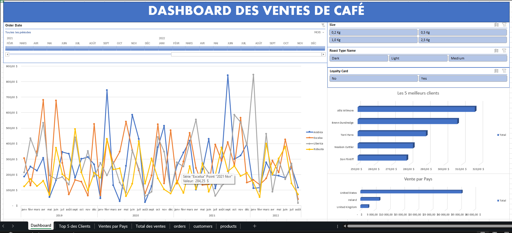

# 📊 Dashboard des Ventes de Café

Découvrez un **tableau de bord interactif sous Excel** conçu pour optimiser le suivi des ventes de café et booster la prise de décision.

## 🚀 Objectif

Permettre aux équipes commerciales et marketing de :

- Suivre l’évolution des ventes par type de café
- Identifier les meilleurs clients
- Cibler les marchés les plus porteurs

## 🖼️ Aperçu

## ⚙️ Points forts

✅ Vue dynamique des ventes mensuelles  
✅ Top 5 des clients les plus fidèles  
✅ Analyse des ventes par pays  
✅ Filtres interactifs : taille de paquet, type de torréfaction, carte fidélité

## 💼 Avantages

- Décisions plus rapides et éclairées
- Identification des segments rentables
- Alignement des actions marketing et commerciales sur les données

## 📂 Contenu

- `Dashboard.xlsx` : Fichier Excel interactif
- `Dashboard.png` : Capture d’écran du dashboard

---

📌 _Ce projet a été réalisé à des fins d’apprentissage en business intelligence et en visualisation de données._

---

# 📞 Call Center Dashboard - Excel

Ce projet présente un **dashboard interactif** développé avec **Microsoft Excel** pour visualiser et analyser les performances d’un centre d'appels.

## 🎯 Objectif

Offrir une vue d’ensemble claire et intuitive des indicateurs clés de performance (KPI) liés à l’activité d’un centre d’appels :

- Nombre d’appels
- Ventes réalisées
- Durée totale des appels
- Note moyenne des clients
- Appels notés 5★
- Répartition des appels et ventes par agent (R01 à R05)
- Répartition hebdomadaire et mensuelle
- Analyse démographique (hommes vs femmes, par ville)

## 📊 Fonctionnalités principales

- **Design professionnel et visuel** à base de graphiques dynamiques
- Suivi des ventes et performances individuelles par représentant
- Analyse de la satisfaction client
- Filtres interactifs pour explorer les données par agent
- Segmentation par ville (Cincinnati, Cleveland, Columbus)
- Suivi des tendances mensuelles et hebdomadaires

## 🛠️ Technologies utilisées

- **Microsoft Excel**
  - Tableaux croisés dynamiques
  - Graphiques en courbes, barres empilées, histogrammes
  - Mise en forme conditionnelle
  - Segments (slicers) pour le filtrage dynamique
  - Formules avancées

## 📷 Aperçu visuel

Vue 1

Vue 2

 |

## 📦 Fichier

- `Call_Center_Dashboard.xlsx`

## 🧠 Ce que j’ai appris

- Structuration de données pour le reporting
- Création de dashboards professionnels sous Excel
- Visualisation interactive des KPI
- Importance de la lisibilité et de la hiérarchisation de l’information

---

📌 _Ce projet a été réalisé à des fins d’apprentissage en business intelligence et en visualisation de données._
