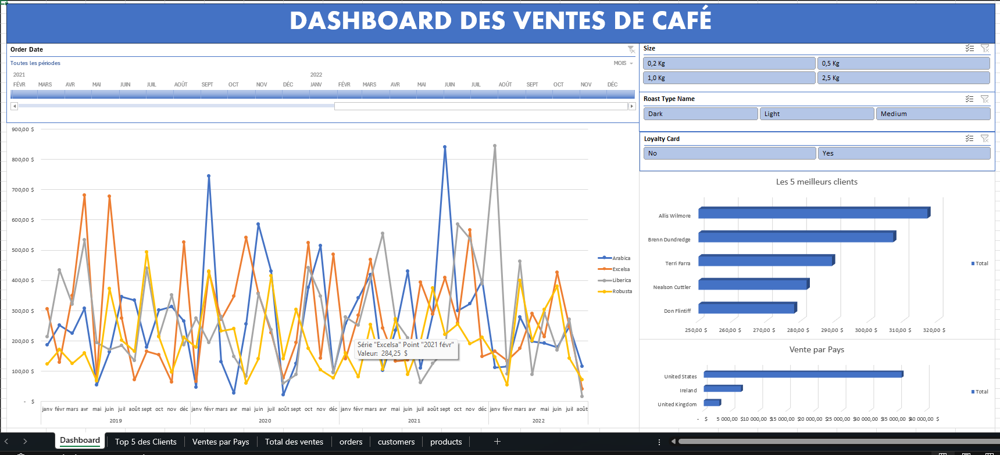

# 📊 Dashboard des Ventes de Café

Découvrez un **tableau de bord interactif sous Excel** conçu pour optimiser le suivi des ventes de café et booster la prise de décision.

## 🚀 Objectif

Permettre aux équipes commerciales et marketing de :
- Suivre l’évolution des ventes par type de café
- Identifier les meilleurs clients
- Cibler les marchés les plus porteurs

## 🖼️ Aperçu

## ⚙️ Points forts

✅ Vue dynamique des ventes mensuelles  
✅ Top 5 des clients les plus fidèles  
✅ Analyse des ventes par pays  
✅ Filtres interactifs : taille de paquet, type de torréfaction, carte fidélité

## 💼 Avantages

- Décisions plus rapides et éclairées
- Identification des segments rentables
- Alignement des actions marketing et commerciales sur les données

## 📂 Contenu

- `Dashboard.xlsx` : Fichier Excel interactif
- `Dashboard.png` : Capture d’écran du dashboard
